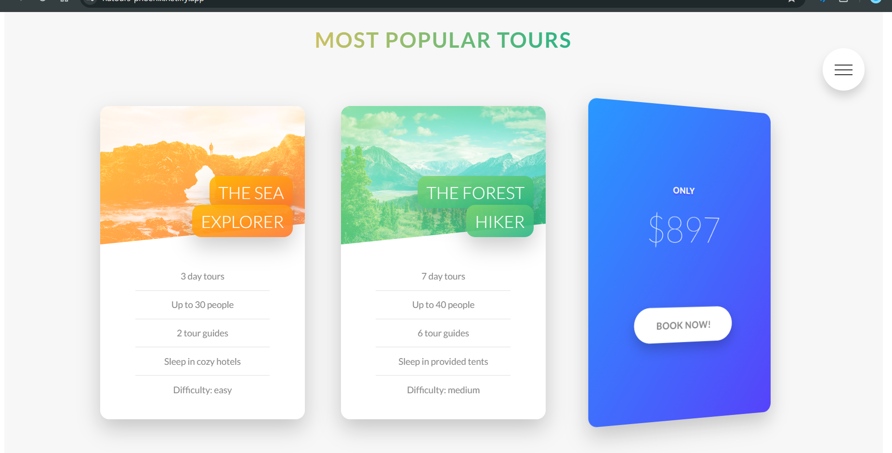

  

# Project Title

This project is based on Jonas Schmedtmann's [ADVANCED HTML-CSS & SASS(SCSS)](https://www.udemy.com/user/jonasschmedtmann/) course. You should check his course. All the credits go to my beautiful teacher Jonas Schmedtmann--

## Omnifood---RESPONSIVE-WEBSITE

✅[View demo](https://ph0enix46.github.io/Natours---RESPONSIVE-WEBSITE/) 🐛[Bug report](https://github.com/pH0enix46/Natours---RESPONSIVE-WEBSITE/issues)


## About
Join us on this life-changing journey of self-discovery and connection with the world around you. Prepare to be awestruck! This journey isn't just a trip, it's a love🧡 affair with nature waiting to blossom. 

Stop dreaming, start adventuring. Book your life-changing tour today! Leave your comfort zone, discover a world beyond your wildest dreams. Adventure is calling! Are you ready?😀

### Screenshots





## Installation

Clone the repo
```
https://github.com/pH0enix46/Natours---RESPONSIVE-WEBSITE.git
```
install
```
npm install
```
✅Enjoy! for learning 

❌But don't copy
## Acknowledgments
My lovely teacher [Jonas Schmedtmann](https://github.com/jonasschmedtmann)


```
Have a nice Day!😸
```
